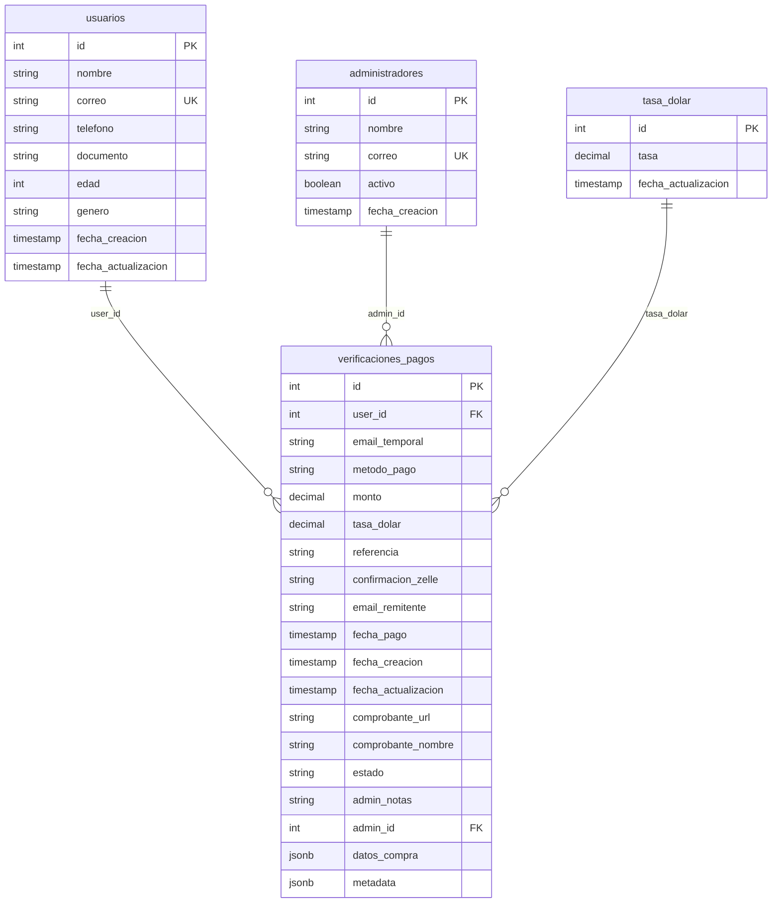

# 🎯 LA MUBI - Estructura Completa de Base de Datos

## 📊 Tablas Existentes

### 1. `usuarios`
```sql
CREATE TABLE usuarios (
    id SERIAL PRIMARY KEY,
    nombre VARCHAR(100) NOT NULL,
    correo VARCHAR(100) UNIQUE NOT NULL,
    telefono VARCHAR(20),
    documento VARCHAR(20),
    edad INTEGER,
    genero VARCHAR(10),
    fecha_creacion TIMESTAMP DEFAULT NOW(),
    fecha_actualizacion TIMESTAMP DEFAULT NOW()
);
```

### 2. `administradores`
```sql
CREATE TABLE administradores (
    id SERIAL PRIMARY KEY,
    nombre VARCHAR(100) NOT NULL,
    correo VARCHAR(100) UNIQUE NOT NULL,
    activo BOOLEAN DEFAULT true,
    fecha_creacion TIMESTAMP DEFAULT NOW()
);
```

### 3. `tasa_dolar`
```sql
CREATE TABLE tasa_dolar (
    id SERIAL PRIMARY KEY,
    tasa DECIMAL(10,2) NOT NULL,
    fecha_actualizacion TIMESTAMP DEFAULT NOW()
);
```

## 🆕 Tablas Nuevas - FASE 5 y FASE 6

### 4. `verificaciones_pagos` (NUEVA - FASE 5)
```sql
CREATE TABLE IF NOT EXISTS verificaciones_pagos (
    -- Campos principales
    id SERIAL PRIMARY KEY,  -- SERIAL para compatibilidad con usuarios.id (integer)
    
    -- Información del usuario
    user_id INTEGER REFERENCES usuarios(id),  -- Para usuarios registrados (integer)
    email_temporal VARCHAR(100),           -- Para usuarios no registrados
    
    -- Información del pago
    metodo_pago VARCHAR(20) NOT NULL CHECK (metodo_pago IN ('pago-movil', 'zelle')),
    monto DECIMAL(10,2) NOT NULL,
    tasa_dolar DECIMAL(10,2) NOT NULL,     -- Tasa al momento del pago
    
    -- Datos específicos por método
    referencia VARCHAR(50),                -- Para Pago Móvil
    confirmacion_zelle VARCHAR(50),        -- Para Zelle
    email_remitente VARCHAR(100),          -- Email del remitente Zelle
    
    -- Timestamps
    fecha_pago TIMESTAMP NOT NULL,          -- Fecha y hora del pago (UTC-4)
    fecha_creacion TIMESTAMP DEFAULT NOW(),
    fecha_actualizacion TIMESTAMP DEFAULT NOW(),
    
    -- Comprobante
    comprobante_url TEXT,                   -- URL del comprobante en Supabase Storage
    comprobante_nombre VARCHAR(255),        -- Nombre original del archivo
    
    -- Estado y gestión
    estado VARCHAR(20) DEFAULT 'pendiente' CHECK (estado IN ('pendiente', 'aprobado', 'rechazado')),
    admin_notas TEXT,                       -- Notas del administrador
    admin_id INTEGER,                          -- ID del admin que procesó (integer)
    
    -- Datos adicionales (flexible)
    datos_compra JSONB DEFAULT '{}',        -- Datos adicionales del formulario
    metadata JSONB DEFAULT '{}',            -- Metadata técnica
    
    -- Índices para rendimiento
    CONSTRAINT verificaciones_email_temporal_check CHECK (
        (user_id IS NOT NULL) OR (email_temporal IS NOT NULL)
    )
);
```

### 📊 Registros Actuales (Ejemplo)
```sql
-- Últimas verificaciones registradas
SELECT * FROM verificaciones_pagos ORDER BY fecha_creacion DESC LIMIT 5;

-- Resultados actuales:
-- id: 8, email_temporal: "llll@lll.com", metodo_pago: "pago-movil", monto: 2250.00
-- id: 7, email_temporal: "kkk@kkk.com", metodo_pago: "pago-movil", monto: 2250.00
-- id: 6, email_temporal: "jjjjj@jjj.com", metodo_pago: "pago-movil", monto: 2250.00
```

## 📋 Índices

### Índices de `verificaciones_pagos`
```sql
-- Índices para optimización
CREATE INDEX IF NOT EXISTS idx_verificaciones_user_id ON verificaciones_pagos(user_id);
CREATE INDEX IF NOT EXISTS idx_verificaciones_email_temporal ON verificaciones_pagos(email_temporal);
CREATE INDEX IF NOT EXISTS idx_verificaciones_estado ON verificaciones_pagos(estado);
CREATE INDEX IF NOT EXISTS idx_verificaciones_metodo_pago ON verificaciones_pagos(metodo_pago);
CREATE INDEX IF NOT EXISTS idx_verificaciones_fecha_creacion ON verificaciones_pagos(fecha_creacion);

-- Índice compuesto para búsquedas comunes
CREATE INDEX IF NOT EXISTS idx_verificaciones_busqueda ON verificaciones_pagos(estado, metodo_pago, fecha_creacion);
```

## 🔐 Row Level Security (RLS)

### Estado RLS Actual
```sql
-- RLS desactivado para MVP (temporal)
ALTER TABLE verificaciones_pagos DISABLE ROW Level Security;

-- Verificar estado
SELECT schemaname, tablename, rowsecurity 
FROM pg_tables 
WHERE tablename = 'verificaciones_pagos';
```

### Políticas RLS (Para futuro)
```sql
-- Políticas creadas pero no activas actualmente
CREATE POLICY "Admins ver todas las verificaciones" ON verificaciones_pagos
    FOR SELECT USING (
        EXISTS (
            SELECT 1 FROM administradores 
            WHERE administradores.id::text = auth.uid()::text
            AND administradores.activo = true
        )
    );

CREATE POLICY "Permitir inserciones públicas" ON verificaciones_pagos
    FOR INSERT TO anon
    WITH CHECK (true);
```

## 🔄 Triggers y Funciones

### Trigger de Timestamp Automático
```sql
-- Función para actualizar timestamp automáticamente
CREATE OR REPLACE FUNCTION actualizar_timestamp_verificaciones()
RETURNS TRIGGER AS $$
BEGIN
    NEW.fecha_actualizacion = NOW();
    RETURN NEW;
END;
$$ LANGUAGE plpgsql;

-- Trigger para actualizar timestamp automáticamente
CREATE TRIGGER trigger_actualizar_timestamp_verificaciones
    BEFORE UPDATE ON verificaciones_pagos
    FOR EACH ROW
    EXECUTE FUNCTION actualizar_timestamp_verificaciones();
```

## 📊 Vistas

### Vista para Dashboard de Admin
```sql
CREATE OR REPLACE VIEW dashboard_verificaciones AS
SELECT 
    vp.id,
    vp.metodo_pago,
    vp.monto,
    vp.tasa_dolar,
    vp.estado,
    vp.fecha_creacion,
    vp.fecha_pago,
    CASE 
        WHEN vp.user_id IS NOT NULL THEN u.nombre
        ELSE vp.email_temporal
    END as identificacion_usuario,
    CASE 
        WHEN vp.user_id IS NOT NULL THEN u.correo
        ELSE vp.email_temporal
    END as email_usuario,
    vp.referencia,
    vp.confirmacion_zelle,
    vp.comprobante_url,
    vp.admin_notas
FROM verificaciones_pagos vp
LEFT JOIN usuarios u ON vp.user_id = u.id
ORDER BY vp.fecha_creacion DESC;
```

## 🗄️ Supabase Storage

### Bucket de Comprobantes
```
Nombre: lamubi-comprobantes
Público: Sí
Límite: 5 MB
MIME types: image/jpeg, image/png, image/webp, image/heic
Políticas: 2 políticas públicas (SELECT, INSERT)
```

## 📝 Comentarios de Tabla
```sql
COMMENT ON TABLE verificaciones_pagos IS 'Tabla para guardar todas las verificaciones de pago de tickets LA MUBI';
COMMENT ON COLUMN verificaciones_pagos.user_id IS 'ID del usuario registrado (si aplica)';
COMMENT ON COLUMN verificaciones_pagos.email_temporal IS 'Email temporal para usuarios no registrados';
COMMENT ON COLUMN verificaciones_pagos.metodo_pago IS 'Método de pago: pago-movil o zelle';
COMMENT ON COLUMN verificaciones_pagos.monto IS 'Monto en bolívares (para pago-móvil) o dólares (para zelle)';
COMMENT ON COLUMN verificaciones_pagos.tasa_dolar IS 'Tasa del dólar al momento del pago';
COMMENT ON COLUMN verificaciones_pagos.estado IS 'Estado: pendiente, aprobado, rechazado';
COMMENT ON COLUMN verificaciones_pagos.datos_compra IS 'Datos adicionales del formulario en formato JSON';
```

## 🔍 Relaciones Entre Tablas



## 📈 Estadísticas Actuales

### Registros de Ejemplo
```sql
-- Última verificación registrada
SELECT * FROM verificaciones_pagos ORDER BY fecha_creacion DESC LIMIT 1;

-- Resultado esperado:
-- id: 7
-- user_id: null
-- email_temporal: "kkk@kkk.com"
-- metodo_pago: "pago-movil"
-- monto: 2250.00
-- tasa_dolar: 450.00
-- referencia: "12345678"
-- fecha_pago: "2026-01-30 20:03:51"
-- comprobante_url: "https://dyzdvucticmszainpxvf.supabase.co/storage/v1/object/public/lamubi-comprobantes/pago-movil_12345678_1769817864727.jpg"
-- estado: "pendiente"
```

## 🚀 Configuración para Producción

### Consideraciones de Seguridad
1. **RLS**: Reactivar para producción
2. **Políticas granulares**: Implementar por rol
3. **Validación de datos**: Añadir constraints adicionales
4. **Backup**: Configurar backups automáticos
5. **Monitoring**: Monitorear rendimiento de consultas

### Optimización Futura
1. **Particionamiento**: Por fecha si crece mucho
2. **Archivado**: Mover registros antiguos
3. **Caching**: Para consultas frecuentes
4. **CDN**: Para imágenes de comprobantes

---

**Última actualización: 30/01/2026 - FASE 6 completada (Generación de Tickets QR)**
